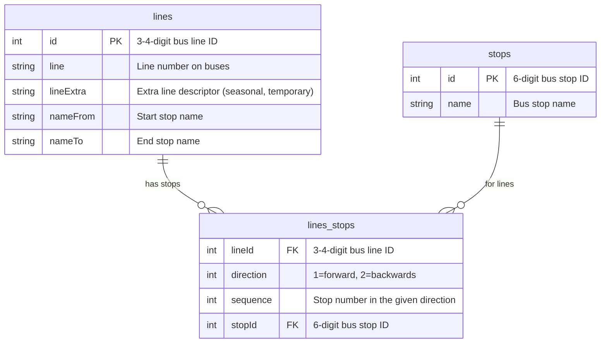

# Slovenia - bus routes in OpenStreetMap

## Ljubljana - Ljubljanski Potniški Promet (LPP)

Fetches the data from [LPP bus schedule](https://www.lpp.si/sites/default/files/lpp_vozniredi/iskalnik/index.php) and saves it into [data/lpp](./data/lpp/):

* [`lines.csv`: Bus lines](data/lpp/lines.csv)
* [`stops.csv`: Bus stops](data/lpp/stops.csv)
* [`lines_stops.csv`: Bus stops on all bus lines](data/lpp/lines_stops.csv)

## Maribor - Marprom

Fetches data from [Marprom WEBMap](https://www.marprom.si/webmap/website/webmap.php) and saves it into [data/marprom](./data/marprom/):

* [`mainlines.geojson`: Bus lines](data/marprom/mainlines.geojson)
* [`stops.geojson`: Bus stops](data/marprom/stops.geojson)

## Development

1. `python3 -m venv venv` or `virtualenv -p python3 venv`
2. `source venv/bin/activate`
3. `pip install -r requirements.txt`
4. `python update.py`
