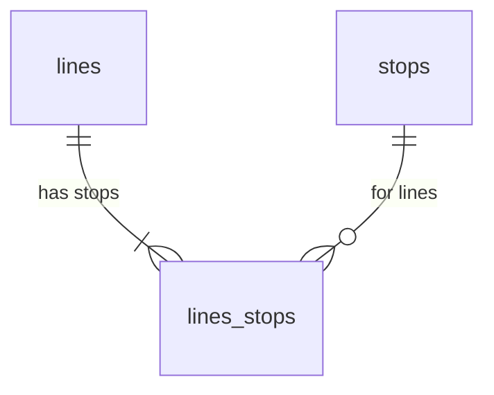

# Ljubljana LPP bus routes in OpenStreetMap

Fetches the data from [LPP bus schedule](https://www.lpp.si/sites/default/files/lpp_vozniredi/iskalnik/index.php) and saves it into [data/lpp](./data/lpp/):

* [Bus lines](data/lpp/lines.csv)
* [Bus stops](data/lpp/stops.csv)
* [Bus stops on all bus lines](data/lpp/lines_stops.csv)

## Development

1. `python3 -m venv venv` or `virtualenv -p python3 venv`
2. `source venv/bin/activate`
3. `pip install -r requirements.txt`
4. `python update.py`

